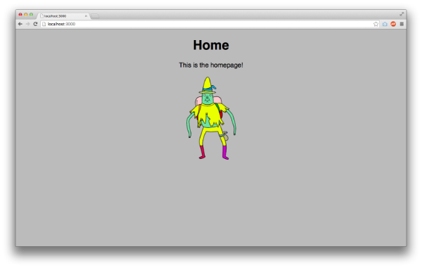
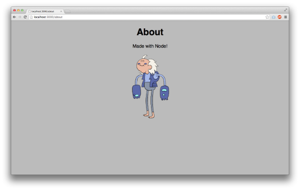
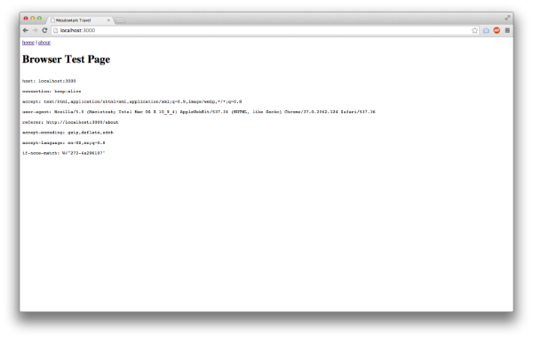
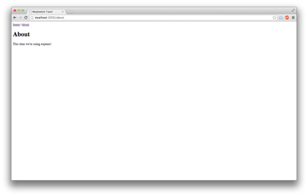

	
Homework #3

	

# Node's HTTP Module, First Express Project, __Due Friday, Feb 26th, by 11PM__

## Overview

### Description

__stringy.js__ - Design objects

__testStringy.js__ - Test your work in <code>stringy.js</code>

__demo.js__ - Create a demo site using node's http module.

__test.js__ - Create a browser test page site using Express.

### Submission Process

You will be given access to a private repository on GitHub. It will contain the following files: __stringy.js__, __testStringy.js__,  __demo.js__ and __test.js__.

* __Push__ your changes to the homework repository on GitHub.
* Commits later than the deadline will not be included in grading

### (3 points) Make at Least 4 Commits

* Commit multiple times throughout your development process.
* Make at least 3 separate commits - (for example, one option may be to make one commit per part in the homework).

## Part 1 - Designing Objects 

Design two objects - one that represents a mutable string and a palindrome (a word that is spelled the same backwards and forwards). Create constructors for both objects: <code>MutableString</code> for mutable strings and <code>Palindrome</code> for palindromes. Every <code>Palindrome</code> object should have a <code>MutableString</code> as its prototype.

Read the following for help on creating objects:

* [slides](http://foureyes.github.io/csci-ua.0480-spring2016-010/slides/06/prototypes.html#/22)
* [mdn](https://developer.mozilla.org/en-US/docs/Web/JavaScript/Inheritance_and_the_prototype_chain)
* [chapter 6 in our book](http://eloquentjavascript.net/06_object.html)

### Object Specifications

In __stringy.js__, create objects, functions and methods that meet the specifications below. You can add as many helper functions or methods as needed. Keep methods on the <code>.prototype</code> property of the appropriate constructor. 

__Remember to add your constructors to module.exports so that they're accessible when you perform a require.__ &rarr;

<pre><code data-trim contenteditable>module.exports.Palindrome = Palindrome;
module.exports.MutableString = MutableString;
</code></pre>

#### (15 points) MutableString

 

<code>MutableString(s)</code> - constructor for <code>MutableString</code> objects

A <code>MutableString</code> object is a string that can be modified and added to. __Empty strings are not supported__.

* parameters:
    * <code>s</code> {string} - string to base this mutable string off of
* returns: 
    * {MutableString} a new <code>MutableString</code> object
* examples:
    <pre><code data-trim contenteditable>var ms = new MutableString("hello");
</code></pre>

 

<code>concat(s)</code> - adds a string to this mutable string object

* parameters:
    * <code>s</code> {string} - string to add
* returns: 
    * no return value
* example: 
    * <pre><code data-trim contenteditable>ms.concat(" world");
</code></pre>

 

<code>validIndex(i)</code> - determines whether or not index, <code>i</code>, exists with this mutable string.

A valid index is an index from 0 up to the length of the string - 1. __Negative values are also valid indexes.__ -1 is the last character and -length of the string is the first character.

* parameters:
    * <code>i</code> {number} - the index to check for
* returns: 
    * {boolean} 
* example: 
    <pre><code data-trim contenteditable>ms = new MutableString("hello");
ms.validIndex(-5); // --> true (h)
ms.validIndex(1); // --> true (e)
ms.validIndex(-7); // --> false (does not exist)
</code></pre>

 

<code>charAt(i)</code> - return the character at index, <code>i</code>.

For positive indexes, 0 is the first character, length of string -1 is the last character. For negative indexes, -1 is the last character and -length of string is the first character. 

If the index doesn't exist, <code>charAt</code> will return <code>undefined</code>

* parameters:
    * <code>i</code> {number} - the index of the character to retrieve
* returns: 
    * {string} - the character at the index specified
* example: 
    <pre><code data-trim contenteditable>ms = new MutableString("hello");
ms.validIndex(-5); // --> h
ms.validIndex(1); // --> e
ms.validIndex(-7); // --> undefined
</code></pre>

 

<code>set(i, ch ... i, ch)</code> - sets character at index, <code>i</code>, to string <code>ch</code>.

<code>set can take an arbitrary number of arguments. Every even argument is an index, every odd is the character to set it to. </code>If an index doesn't exist, then the character is not set. If the last argument is only an index (that is, there is no corresponding character), ignore it. Negative indexes are allowed.

* parameters:
    * <code>i</code> {number} - the index where the new character will be set
    * <code>ch</code> {string} - the value to set the character to (no validation is required to make sure that <code>ch</code> is only one character long).
* returns: 
    * no return value
* examples: 
    <pre><code data-trim contenteditable>var ms = new MutableString("hello");
ms.set(0, "c", -1, "s"); // --> ms will represent "cells"
var ms = new MutableString("hello");
ms.set(0, "c", -1); // --> ms will represent "cello" (-1 is ignored)
var ms = new MutableString("hello");
ms.set(-100, "c"); // --> ms will represent "hello" (-100 is ignored)
</code></pre>

 

<code>toString()</code> - gives back a "_normal_" string representation of the mutable string.

* parameters:
    * none
* returns:
    * {string} a string that represents the mutable string
* examples: 
    <pre><code data-trim contenteditable>var ms = new MutableString("hello");
console.log(ms.toString()) // --> hello
</code></pre>

 

<code>toCharArray()</code> - gives back an array of string representation of the mutable string. Each element represents a single character in the mutalbe string.

* parameters:
    * none
* returns:
    * {Array} an Array of strings that represents the mutable string
* examples: 
    <pre><code data-trim contenteditable>var ms = new MutableString("cat");
console.log(ms.toCharArray()) // --> ['c', 'a', 't']
</code></pre>

#### (10 points) Palindrome

<code>Palindrome</code> objects will support all of the same methods that <code>MutableString</code> does (hey - this sounds like _inheritance_). However, there are three major differences:

* the constructor will throw an exception if the string passed in is not the same forward and backwards (not symmetric)
    * <code>var p = new Palindrome("nope!")</code> - throw an exception
* <code>set</code> will throw an exception if setting all of the indexes to the characters breaks the symmetry of the palindrome (and no characters will be set)
    <pre><code data-trim contenteditable>var p = new Palindrome("racecar");
p.set(-1, "t"); // throws an exception
</code></pre>    
* <code>concat</code> will throw an exception if adding the string breaks the symmetry of the palindrome (and nothing will be added)
    <pre><code data-trim contenteditable>var p = new Palindrome("racecar");
p.concat("s"); // throws an exception
</code></pre>    

#### (5 points) Testing Your Module

Import the module that you created... 

<pre><code data-trim contenteditable>var stringy = require('./stringy.js');
var MutableString = stringy.MutableString;
var Palindrome = stringy.Palindrome;
</code></pre>

And run these tests:

<pre><code data-trim contenteditable>
console.log("testing MutableString constructor\n-----");
var s = new MutableString("hello");
console.log(s.toString());

console.log("\ntesting charAt\n-----");
console.log(s.charAt(4));
console.log(s.charAt(-1));
console.log(s.charAt(-5));
console.log(s.charAt(-7));
console.log(s.charAt(7));

console.log("\ntesting toCharArray\n-----");
console.log(s.toCharArray());

console.log("\ntesting concat\n-----");
s.concat(" world!");
console.log(s.toString());

console.log("\ntesting set\n-----");
s.set(0, 'c');
console.log(s.toString());
s.set(-1, '?');
console.log(s.toString());
s.set(-100, 'X');
console.log(s.toString());
s.set(-1, 'd', -2, 'e', -3, 'k');
console.log(s.toString());
s.set(0, 'b', -100, 'X', -101, 'Y', 4, 's', 5 );
console.log(s.toString());

console.log("\ntesting Palindrome constructor\n-----");
var p1 = new Palindrome('minim');
console.log(p1.toString());

console.log("\ntesting charAt\n-----");
console.log(p1.charAt(0));
console.log(p1.charAt(-1));

console.log("\ntesting set\n-----");
p1.set(1, 'a', 2, 'd', 3, 'a');
console.log(p1.toString());

console.log("\ntesting set with exception\n-----");
try {
  p1.set(0, 1);
} catch(e) {
  console.log('exception caught: ' + e.message);
}

console.log("\ntesting toCharArray\n-----");
console.log(p1.toCharArray());

console.log("\ntesting concat\n-----");
p1.concat('imadam');
console.log(p1.toString());

console.log("\ntesting concat exception:\n-----");
try {
  p1.concat('!');
} catch(e) {
  console.log('exception caught: ' + e.message);
}

console.log("\ntesting constructor exception\n-----");
try {
  var p2 = new Palindrome('car');
} catch(e) {
  console.log('Exception caught: ' + e.message);
}
</code></pre>

The resulting output should be:

<pre><code data-trim contenteditable>
testing MutableString constructor
-----
hello

testing charAt
-----
o
o
h
undefined
undefined

testing toCharArray
-----
[ 'h', 'e', 'l', 'l', 'o' ]

testing concat
-----
hello world!

testing set
-----
cello world!
cello world?
cello world?
cello worked
bells worked

testing Palindrome constructor
-----
minim

testing charAt
-----
m
m

testing set
-----
madam

testing set with exception
-----
exception caught: Result from set is not symmetric

testing toCharArray
-----
[ 'm', 'a', 'd', 'a', 'm' ]

testing concat
-----
madamimadam

testing concat exception:
-----
exception caught: Result from concatentation is not symmetric

testing constructor exception
-----
Exception caught: Palindrome not symmetric
</code></pre>

## Part 2 - Demo Site

Create a small demo site using node's <code>http</code> module. Use the <code>fs</code> module to serve static files.

Note that this part of the assignment is based off of slides from __class 7__ and Chapter 2 - __Getting Started With Node__ from {{ site.book_web }}.

### Web Server and Routing

* (12 points) The site should respond to the following urls with the specified status code, content-type and body:
	* <code>/</code> - __homepage__
		* <code>200</code>
		* <code>text/html</code>
		* body from <code>./public/index.html</code>
	* <code>/home</code> - __homepage__
		* <code>200</code>
		* <code>text/html</code>
		* body from <code>./public/index.html</code>
	* <code>/about</code> - __about page__
		* <code>200</code>
		* <code>text/html</code>
		* body from <code>./public/about.html</code>
	* <code>/me</code>  - __about page (redirect)__
		* <code>301</code>
		* this should redirect to <code>/about</code>
		* do this by setting an appropriate response header 
		* __(you'll need to do some research to find out which header you should set)__
			* __TRY USING  <code>curl</code> or Chrome's web developer tools while making a request to google.com (no www)__
			* what status code does it give back?
			* what body does it give back (if any)?
			* does it include any additional headers? (hint: __it does, and it's important!__)
			* use the above information to craft an appropriate response
			* __don't just send back the same template as about__ ... instead, just send back the response code and appropriate header
	* <code>/img/image1.png</code> - __image1__
		* <code>200</code>
		* <code>image/png</code>
		* body from <code>./public/img/image1.png</code>
	* <code>/img/image2.png</code> - __image2__
		* <code>200</code>
		* <code>image/png</code>
		* body from <code>./public/img/image2.png</code>
	* <code>/css/base.css</code> - __stylesheet__
		* <code>200</code> 
		* this is a stylesheet, so set your content-type appropriately
		* __(do some research to find the right content-type)__
		* contents of file should come from <code>./public/css/base.css</code>
	* <code>[any other url]</code> - __page not found__
		* <code>404</code> 
		* <code>text/html</code> 
		* body from <code>/public/404.html</code>
	* <code>[server error]</code>
		* if a static file can't be loaded...
		* respond with a 500
* (2 points) __Every url should respond to any casing__ (for example both <code>ABOUT</code> and <code>about</code> should work)
* (2 points) __Every url should work with or without a trailing slash__ (for example both <code>about</code> and <code>about/</code> should work)

### (3 points)Static File Content

* The contents of the static files are as follows:
	* __index.html__ 
		* a heading (an h1) that says: <code>Home</code>
		* a paragraph with any text (whatever text you like)
		* an image named image1.png (whatever image you like)
	* __about.html__ 
		* a heading (an h1) that says: <code>About</code>
		* a paragraph with any text (whatever text you like)
		* an image named image2.png (whatever image you like)
	* both pages should use the __base.css__ stylesheet:
		* sets the body font to 1.5em
		* center aligns everything
		* sets the font to sans-serif
		* sets the background to light gray (#aaaaaa)
* See some example screen shots below:

### (3 points) Logging

* __log every request to the console__
* a log line should consist of:
	* the date and time of the request (do research on the __Date__ object and its __toLocaleString__ method)
	* the request method (GET, POST, etc.)
	* the url requested (for example, <code>/about</code>)
	* the status code of the response (for example, <code>200</code>)
* __Here's an example of the format to follow:__ &rarr;

<pre><code data-trim contenteditable>Tue Sep 28 2015 23:02:37 GMT-0400 (EDT) GET / 200 OK
Tue Sep 28 2015 23:02:37 GMT-0400 (EDT) GET /img/image1.png 200 OK
Tue Sep 28 2015 23:02:43 GMT-0400 (EDT) GET /doesnotexist 404 Not Found
Tue Sep 28 2015 23:03:10 GMT-0400 (EDT) GET /me 301 Moved Permanently
Tue Sep 28 2015 23:03:10 GMT-0400 (EDT) GET /about 200 OK
Tue Sep 28 2015 23:03:10 GMT-0400 (EDT) GET /img/image2.png 200 OK
</code></pre>

### (4 points) Testing Your Site

* Create a file called __output.txt__
* __Use curl -I to run the following requests__ ... copy and paste the output (it should only be the headers) to your output.txt file 
	* <code>/</code>
	* <code>/about</code>
	* <code>/ABOUT</code>
	* <code>/about/</code>
	* <code>/me</code>
	* <code>/css/base.css</code>
	* <code>/img/image1.png</code>

## Part 3 - Browser Test Page

Create a small site using Express. The site will only have two pages... the index page which will show all of the headers that a browser requested... and an about page.

The index page will display all of the headers that the browser sent to the server.

Note that this part of the assignment is based off of slides from __class 8__ and Chapter 3 - __Saving Time With Express__ from {{ site.book_web }}.

### (5 points) Project Setup Requirements

* Create a <code>package.json</code> by running <code>npm init</code> in your project directory. You can use the default answers to all of the questions
* Install your web framework, <code>express</code> and your templating library, <code>express3-handlebars</code> using the <code>--save</code> flag to save your dependencies
* For example: <code>npm install --save express</code> 
* Make sure you do this in your project's root directory
* You should see a <code>node_modules</code> directory
* Ignore it using .gitignore

### (4 points) Web Server and Routing

The site should respond to the following urls with the specified views (the path is relative to your project's root directory):

* <code>/</code> - __browser test page / index__
	* <code>views/index.handlebars</code>
* <code>/about</code> - __about__
	* <code>views/about.handlebars</code>
* <code>[any other url]</code> - __404__
	* explicitly send back a <code>404</code>
	* <code>views/404.handlebars</code>

### (7 points) Content

* __all of your views should be in a directory called <code>views</code> in the root of your project directory__
* all of the views should be based off of a layout 
	* this layout is <code>main.handlebars</code>
	* which should be located in <code>views/layouts</code>
	* it should contain all of the surrounding tags - (html, head, body, etc.) 
	* as well as links to both of the other pages <code>/</code> and <code>about</code>
* the about page should contain 
	* a single heading that says <code>About</code>
	* some text in a paragraph tag underneath
* the index page should contain
	* a single heading that says <code>Browser Test Page</code>
	* within a <code>pre</code> tag, all of the headers that were sent as part of the browser's request
	* you can do this by: 
		* handing the headers to over to the view (as part of the the 2nd argument passed into <code>res.render()</code>)
		* in your view, using the each helper to iterate over the <code>headers</code> object
		* [see the docs on the each helper](http://handlebarsjs.com/builtin_helpers.html)
	* an example of the contents of the index page, as well as some screens:

<pre><code data-trim contenteditable>host: localhost:3000
connection: keep-alive
accept: text/html,application/xhtml+xml,application/xml;q=0.9,image/webp,*/*;q=0.8
user-agent: Mozilla/5.0 (Macintosh; Intel Mac OS X 10_9_4) AppleWebKit/537.36 (KHTML, like Gecko) Chrome/37.0.2062.124 Safari/537.36
referer: http://localhost:3000/about
accept-encoding: gzip,deflate,sdch
accept-language: en-US,en;q=0.8
</code></pre>

